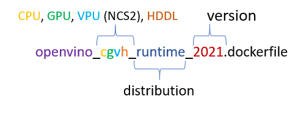

# Dockerfiles with [Intel® Distribution of OpenVINO™ toolkit](https://github.com/openvinotoolkit/openvino)
This repository folder contains Dockerfiles to build an docker image with the Intel® Distribution of OpenVINO™ toolkit.
You can use Docker CI framework to build an image, please follow [Get Started with DockerHub CI for Intel® Distribution of OpenVINO™ toolkit](../get-started.md).

1. [Supported Operating Systems for Docker image](#supported-operating-systems-for-docker-image)  
2. [Supported devices and distributions](#supported-devices-and-distributions)  
3. [Where to get OpenVINO package](#where-to-get-openvino-package)
4. [How to build](#how-to-build)  
5. [Prebuilt images](#prebuilt-images)  
6. [How to run a container](#how-to-run-a-container)  

## Supported Operating Systems for Docker image:
 - `ubuntu18` folder (Ubuntu* 18.04 LTS)
 - `ubuntu20` folder (Ubuntu* 20.04 LTS)
 - `centos7` folder (CentOS* 7)
 - `centos8` folder (CentOS* 8)
 - `rhel8` folder (RHEL* 8) 
 - `winserver2019` folder (Windows* Server Core base OS LTSC 2019)

## Supported devices and distributions


    
 **Devices:**
 - CPU
 - GPU
 - VPU (NCS2)
 - HDDL (VPU HDDL) (_Prerequisite_: run HDDL daemon on the host machine, follow the [configuration guide for HDDL device](../install_guide_vpu_hddl.md))
 
 OpenVINO documentation for [supported devices](https://docs.openvinotoolkit.org/latest/openvino_docs_IE_DG_supported_plugins_Supported_Devices.html).
 
 **Distributions:**
 - **runtime**: IE core, nGraph, OpenCV, plugins
 - **data_runtime**: runtime image content + DL Streamer runtimes
 - **dev**: IE core, nGraph, OpenCV, plugins, samples, demos, Python dev tools: Model Optimizer, Post training Optimization tool, Accuracy checker, Open Model Zoo tools (downloader, converter) 
 - **data_dev**: data_runtime image + dev image + Media SDK, Speech Libraries and End-to-End Speech Demos
 - **base** (only for CPU): IE core, nGraph
 - **proprietary**: data_dev + installer
 
You can generate Dockerfile with your settings, please follow the [DockerHub CI documentation](../get-started.md).
 * _runtime, data_runtime, dev, data_dev_ distributions based on archive package of OpenVINO product. You can just remove unnecessary parts.
 * _base_ distribution is created by [OpenVINO™ Deployment Manager](https://docs.openvinotoolkit.org/latest/openvino_docs_install_guides_deployment_manager_tool.html).
 * _proprietary_ distribution based on installer package of OpenVINO product. You can configure installation `COMPONENTS`, follow [Command-Line Silent Instructions](https://docs.openvinotoolkit.org/latest/openvino_docs_install_guides_installing_openvino_linux.html)
 * _proprietary, dev, data_dev_ distributions images for Ubuntu 18 contain Python TensorFlow* 2. virtual environment in `/opt/intel/venv_tf2` folder for Model Optimizer and Model Downloader/Converter, 
 because TensorFlow* 1. (default in the image) and TensorFlow* 2. are not compatible. Please follow this [guide](https://docs.python.org/3/tutorial/venv.html#creating-virtual-environments) to activate and use it. Ubuntu 20 based images have TensorFlow* 2 by default and don't have TensorFlow* 1 environment.

## Where to get OpenVINO package

You can get OpenVINO distribution packages (runtime, dev, data_dev) directly from [public storage](https://storage.openvinotoolkit.org/repositories/openvino/packages/) and proprietary package with registration [here](https://software.intel.com/content/www/us/en/develop/tools/openvino-toolkit/download.html).
For example: 
* take data_dev `l_openvino_toolkit_data_dev_ubuntu18_p_2021.2.185.tgz` package and specify `-dist data_dev` option for Docker CI `docker_openvino.py` or take a Dockerfile with `data_dev` suffix.
* take runtime `l_openvino_toolkit_runtime_ubuntu18_p_2021.2.185.tgz` package and specify `-dist runtime` or `-dist data_runtime` option for Docker CI `docker_openvino.py` or take a Dockerfile with `runtime`/`data_runtime` suffix.
* take proprietary `l_openvino_toolkit_p_2021.3.249.tgz` package and specify `-dist proprietary` option for Docker CI `docker_openvino.py`  or take a Dockerfile with `proprietary` suffix.

## How to build

* Base image with CPU only:

You can use Docker CI framework to build an image, please follow [Get Started with DockerHub CI for Intel® Distribution of OpenVINO™ toolkit](../get-started.md).

```bash
python3 docker_openvino.py build --file "dockerfiles/ubuntu18/openvino_c_base_2020.3.dockerfile" -os ubuntu18 -dist base -p 2020.3.341
```
Or via Docker Engine directly, but you need specify `BUILD_ID` argument:
```bash
docker build --build-arg BUILD_ID=2020.3.341 -t ubuntu18_base_cpu:2020.3.341 - < dockerfiles/ubuntu18/openvino_c_base_2020.3.dockerfile
```
----------------

* Dev/data_dev/runtime/data_runtime/proprietary image:

You can use Docker CI framework to build an image, please follow [Get Started with DockerHub CI for Intel® Distribution of OpenVINO™ toolkit](../get-started.md).

```bash
python3 docker_openvino.py build --file "dockerfiles/ubuntu18/openvino_cgvh_dev_2021.dockerfile" -os ubuntu18 -dist dev -p 2021.1
```
For data_dev/runtime/data_runtime/proprietary distributions, please set appropriate `-dist` and `--file` options.

Or via Docker Engine directly, but you need specify `package_url` argument (see [Where to get OpenVINO package section](#where-to-get-openvino-package)) and OpenCL* version to support GPU:
`GMMLIB`, `IGC_CORE`, `IGC_OPENCL`, `INTEL_OPENCL`, `INTEL_OCLOC`
```bash
docker build --build-arg package_url=https://storage.openvinotoolkit.org/repositories/openvino/packages/2021.1/l_openvino_toolkit_dev_ubuntu18_p_2021.1.110.tgz \
             --build-arg GMMLIB=19.3.2 \
             --build-arg IGC_CORE=1.0.2597 \
             --build-arg IGC_OPENCL=1.0.2597 \
             --build-arg INTEL_OPENCL=19.41.14441 \
             --build-arg INTEL_OCLOC=19.41.14441 \
            -t ubuntu18_dev:2021.1 -f dockerfiles/ubuntu18/openvino_cgvh_dev_2021.dockerfile .
```
----------------

* Custom image with CPU, iGPU, VPU support  
To learn more, follow [Build custom Intel® Distribution of OpenVINO™ toolkit Docker image](ubuntu18/build_custom/README.md).

## Prebuilt images

Prebuilt images are available on [Docker Hub](https://hub.docker.com/u/openvino)

## How to run a container

Please follow [Run a container](../get-started.md#run-a-container) section in DockerHub CI getting started guide.

## Documentation

* [Install Intel® Distribution of OpenVINO™ toolkit for Linux* from a Docker* Image](https://docs.openvinotoolkit.org/latest/openvino_docs_install_guides_installing_openvino_docker_linux.html)
* [Install Intel® Distribution of OpenVINO™ toolkit for Windows* from Docker* Image](https://docs.openvinotoolkit.org/latest/openvino_docs_install_guides_installing_openvino_docker_windows.html)
* [Official Dockerfile reference](https://docs.docker.com/engine/reference/builder/)
---
\* Other names and brands may be claimed as the property of others.
